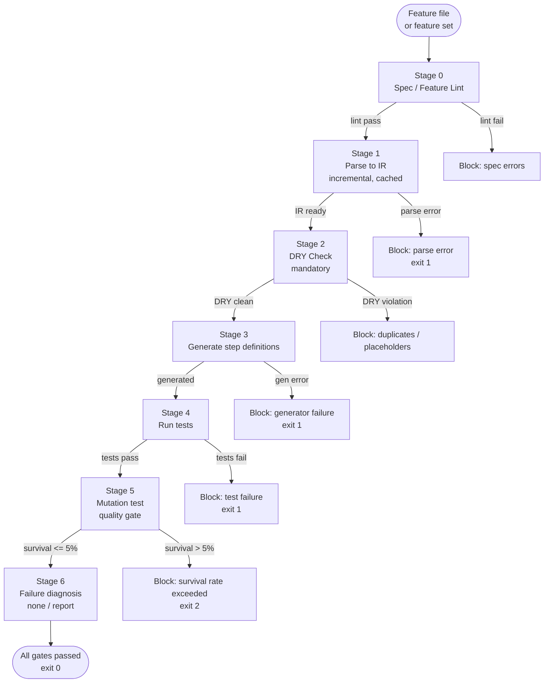

# Acceptance Pipeline — EricStack Process Discipline

**The deterministic pipeline that turns a Gherkin feature into a passing, mutation-verified acceptance test.**

The Acceptance Pipeline Specification (APS) is the canonical workflow that takes a `*.feature` file and produces a verified acceptance result through seven tightly-scoped stages. Each stage emits an artifact; each artifact is cached and validated by a quality gate before the next stage is allowed to start.

```
Feature (Gherkin)  →  IR  →  DRY check  →  Generated steps  →  Executed tests  →  Mutated tests  →  Diagnosis
   Stage 0            Stage 1    Stage 2         Stage 3          Stage 4            Stage 5            Stage 6
```

This skill is the **orchestrator** — it does not parse, generate, or run tests itself. It dispatches each stage to a specialized sub-skill, gates the transition between stages, and produces a single exit code suitable for CI.

---

## Why a Pipeline?

Three forces make ad-hoc acceptance testing unreliable:

1. **Ambiguous specs.** A feature file that reads cleanly to a human can still be ambiguous enough to generate ten different step definitions.
2. **DRY violations.** Two scenarios that look similar often diverge in subtle ways that generate duplicated step code.
3. **Weak assertions.** A test that passes does not prove the test is meaningful. Mutation testing is the only reliable signal.

APS enforces all three through stages 0, 2, and 5 respectively. The remaining stages (1, 3, 4) are the mechanical pipeline: parse, generate, run. Stage 6 is the post-mortem lane that explains *why* a gate failed and routes the agent to the right fixer skill.

---

## Pipeline Flow



The pipeline is **fail-fast by default**: any block halts the run with a non-zero exit code unless `--no-fail-fast` is supplied (no such flag exists — see "Quality Gates" below; fail-fast is mandatory in CI).

---

## The 7 Stages

### Stage 0 — Spec / Feature Lint

**Goal:** Catch malformed or non-executable Gherkin before any expensive work.

| Item | Description |
|---|---|
| Input | `*.feature` files (changed or full set) |
| Output | Lint report (errors, warnings, counts) |
| Dispatched by | Local linter; no sub-skill required |
| Cacheable | No (cheap) |
| Blocking | Yes — any error blocks Stage 1 |

**Lint checks:**
- Feature has at least one Scenario
- Every Scenario has at least one Given / When / Then
- Step keywords are uppercase
- No empty Examples tables
- Tags follow `@lowercase` convention
- No duplicated Scenario names within a Feature

If any check fails, the pipeline halts with a report. Stage 0 is **always** run, even when `--changed-only` is set, because a malformed spec is the most common cause of downstream confusion.

### Stage 1 — Parse (incremental)

**Goal:** Convert Gherkin into an Intermediate Representation (IR) suitable for code generation.

| Item | Description |
|---|---|
| Input | Lint-passed `.feature` files |
| Output | `ir.json` per feature (cached by `(path, mtime, content_hash)`) |
| Dispatched by | `erics-ability-bdd` (parse mode) |
| Cacheable | Yes — see Caching Strategy |
| Blocking | Yes — parse error → exit 1 |

The IR is a normalized JSON tree with these nodes:
- `Feature` — name, description, tags, scenarios
- `Scenario` — title, tags, steps, examples (for outlines)
- `Step` — keyword, text, table/doc-string
- `Example` — row objects for Scenario Outlines

The parser is **incremental**: only files whose mtime or content hash has changed since the last successful parse are re-parsed. See Caching Strategy.

### Stage 2 — DRY Check (mandatory)

**Goal:** Ensure generated step code does not duplicate logic across scenarios.

| Item | Description |
|---|---|
| Input | `ir.json` from Stage 1 |
| Output | DRY report (counts of duplicates, placeholder variants) |
| Dispatched by | `erics-ability-bdd` (dry mode) |
| Cacheable | No (must run on every feature set) |
| Blocking | Yes — see Quality Gates |

DRY checks two axes:

1. **Cross-scenario step duplication.** Steps with identical (Given|When|Then) text inside a Feature count as duplicates. The DRY gate blocks when `duplicate-in-scenario > 0`.
2. **Placeholder variant explosion.** Scenario Outlines whose Examples generate more than 3 mutually-distinct step signatures per Given/When/Then count as a `placeholder-variant` violation. The gate blocks when `placeholder-variant > 3`.

When DRY fails, the agent is routed to a refactor skill — typically `erics-process-find-simplifications` for the Feature file or `erics-ability-spec` for clarifying intent. DRY is **mandatory** and cannot be skipped; it is the only thing standing between a passing test and ten copy-pasted step definitions.

### Stage 3 — Generate

**Goal:** Produce executable step definitions from the IR.

| Item | Description |
|---|---|
| Input | DRY-passed IR |
| Output | Step definition files (language-specific) |
| Dispatched by | `erics-ability-bdd` (generate mode) — falls back to `erics-ability-test-runner` for non-Gherkin stacks |
| Cacheable | Yes — generated files keyed by IR hash |
| Blocking | Yes — generator failure → exit 1 |

The generator language is auto-detected from the repository:
- `features/steps/*.py` + `behave` → Python step defs
- `*.spec.ts` + `@cucumber/cucumber` → TypeScript step defs
- `features/steps/*.rb` + `cucumber-ruby` → Ruby step defs

A generator failure (e.g., unsupported step keyword) blocks the pipeline with exit 1 and surfaces the failing scenario and step text.

### Stage 4 — Run

**Goal:** Execute the generated step definitions and report pass/fail per scenario.

| Item | Description |
|---|---|
| Input | Generated step definitions |
| Output | Test report (JUnit XML + console summary) |
| Dispatched by | `erics-ability-test-runner` |
| Cacheable | No — must always run for changed code |
| Blocking | Yes — any test failure → exit 1 |

The runner is language-aware and uses the project's existing test stack. Test failures bubble up with file:line and scenario:step attribution so the diagnosis stage (6) can route the agent to the right fixer.

### Stage 5 — Mutate (quality gate)

**Goal:** Prove the tests are meaningful by injecting faults and verifying the suite catches them.

| Item | Description |
|---|---|
| Input | Passing test run + production code under test |
| Output | Mutation report (killed / survived / timeout / incompetent counts) |
| Dispatched by | `erics-process-mutation` |
| Cacheable | Yes — by `implementation_hash` (see Caching Strategy) |
| Blocking | Yes — survival rate > 5% → exit **2** (distinct from run errors) |

Mutation is the **trust gate**. If 95% of injected faults are caught, the suite is meaningful. Below 95% survival, the suite has blind spots and **must** be expanded. This is the only stage with a unique non-error exit code: `2`. CI scripts use this to distinguish "tests fail" (exit 1, fix code) from "tests are weak" (exit 2, add tests).

### Stage 6 — Failure Diagnosis

**Goal:** Produce an actionable explanation when any earlier stage blocks, and route to the right fixer skill.

| Item | Description |
|---|---|
| Input | Block report from any prior stage |
| Output | Diagnosis report + routing recommendation |
| Dispatched by | APS itself (orchestrator) + `erics-ability-investigate` for deep diagnosis |
| Cacheable | No (always fresh per run) |
| Blocking | No — always reports and exits |

Stage 6 runs **only** when an earlier stage blocks. Its job is to convert a raw error into a human-readable "what to fix and where" report. The report format is:

```
## Diagnosis

### Stage that blocked
Stage N — <name>

### What failed
<one-sentence summary>

### Evidence
- File: <path>:<line>
- Scenario: <name>
- Step: <text>

### Recommended fixer skill
<erics-ability-* or erics-process-* skill>

### Confidence
<low|medium|high>
```

With `--explain-failure` the diagnosis is always printed, even on success — useful for understanding what the pipeline observed.

---

## CLI Interface

The pipeline is invoked through a single entrypoint:

```bash
aps run [options]
```

### Flags

| Flag | Type | Default | Description |
|---|---|---|---|
| `--ci` | boolean | `false` | Run in CI mode. Forces non-interactive output, disables progress spinner, sets `--fail-fast`, treats warnings as errors, and exits non-zero on any gate breach. |
| `--dry-run` | boolean | `false` | Walk the full pipeline without writing artifacts or running tests. Useful for verifying the gate graph on a feature set. |
| `--changed-only` | boolean | `false` | Restrict the feature set to files changed since `HEAD~1` (or `main`). Stage 0 still lints the entire repo to detect cross-feature conflicts. |
| `--no-cache` | boolean | `false` | Bypass the IR cache and mutation cache; force re-parse and re-mutate. Use when you suspect stale artifacts. |
| `--fail-fast` | boolean | `true` | Halt on the first gate breach. Always true in CI; can be set to `false` only in `--dry-run` to enumerate all breaches. |
| `--verbose` | boolean | `false` | Print stage-by-stage progress with timing and artifact sizes. |
| `--quiet` | boolean | `false` | Suppress non-error output. Mutually exclusive with `--verbose`. |
| `--progress` | boolean | `auto` | Show a progress spinner during long stages (parse, mutate). `auto` shows on TTY, hides in CI. |
| `--explain-failure` | boolean | `false` | Always emit the Stage 6 diagnosis, even on success. Helpful for understanding what the pipeline saw. |
| `--trace` | boolean | `false` | Emit a full stage trace (input/output hashes, dispatch decisions, cache hits) to `aps-trace.jsonl` for debugging. |

### Examples

```bash
# Local dev: run full pipeline on changed features, with progress and explanations
aps run --changed-only --progress --explain-failure

# CI: strict mode, no cache, fail fast, trace for debugging
aps run --ci --no-cache --fail-fast --trace

# Audit: see what gates would trip without writing anything
aps run --dry-run --verbose

# Investigate a flaky run: force re-parse and re-mutate
aps run --changed-only --no-cache --explain-failure
```

---

## Exit Codes

| Code | Meaning | Cause | Action |
|---|---|---|---|
| `0` | All gates passed | Stages 0-5 clean | Merge / ship |
| `1` | Parse / generate / run error | Stage 1 parse error, Stage 3 generator failure, Stage 4 test failure | Fix code or spec, re-run |
| `2` | Mutation survival rate exceeded | Stage 5 survival_rate > 5% | Add or strengthen tests, re-run |

Exit code `2` is **distinct** from exit code `1`. CI should treat them differently:

```bash
aps run --ci
rc=$?
case $rc in
  0) echo "Acceptance verified" ;;
  1) echo "Acceptance FAILED — fix code or spec" ; exit 1 ;;
  2) echo "Tests are WEAK — add tests until survival <= 5%" ; exit 2 ;;
  *) echo "Pipeline error (rc=$rc)" ; exit $rc ;;
esac
```

Other non-zero codes (3+) are reserved for pipeline infrastructure errors (cache corruption, dispatcher failure) and should be treated as bugs.

---

## Caching Strategy

APS uses two caches to keep incremental runs fast.

### IR Cache

**Location:** `.aps/cache/ir/`

**Key:** `(path, mtime_ns, content_hash)` where `content_hash = sha256(file_contents)`.

**Value:** The IR JSON emitted by Stage 1.

**Invalidation:** A cache entry is reused when **all three** match:
1. Path is unchanged
2. mtime is unchanged
3. Content hash is unchanged

If any of the three differs, the IR is re-parsed. The content hash catches the case where mtime is preserved (e.g., `git checkout` restores mtime but content changes).

`--no-cache` bypasses the IR cache entirely.

### Mutation Cache

**Location:** `.aps/cache/mutation/`

**Key:** `implementation_hash = sha256(production_source + test_source + dep_lockfile_hash)`

**Value:** Mutation report JSON (killed / survived counts and per-mutant results).

**Invalidation:** Any change to production code, test code, or dependency lockfile re-runs mutation. This is intentional — even a one-line behavior change can flip a mutant from survived to killed (or vice versa).

`--no-cache` bypasses the mutation cache.

### Cache Hygiene

The cache directory is **not** committed (add `.aps/` to `.gitignore`). The cache is safe to delete at any time; the next run will simply re-build it.

For CI, mount the cache as a job-scoped volume when possible to amortize IR parsing across stages of the same pipeline run. Mounting across runs is risky because implementation hashes drift with dependency upgrades.

---

## Quality Gates

Three gates block the pipeline. Each has a hard threshold and a distinct failure mode.

| Gate | Trigger | Threshold | Action on breach |
|---|---|---|---|
| Duplicate in scenario | Stage 2 finds duplicate step text within a single Feature | `duplicate-in-scenario > 0` | Block, route to refactor |
| Placeholder variant | Stage 2 finds a Scenario Outline whose Examples generate > 3 distinct step signatures per Given/When/Then | `placeholder-variant > 3` | Block, route to spec clarification |
| Survival rate | Stage 5 mutation run completes | `survival_rate > 5%` | Block with **exit code 2**, route to test expansion |

### Gate Semantics

- **Duplicate in scenario > 0.** Two scenarios sharing the same Given/When/Then text usually indicates the steps were copy-pasted rather than abstracted. Refactoring the spec into a shared Background or parameterized Outline produces cleaner code.
- **Placeholder variant > 3.** A Scenario Outline that explodes into many distinct step signatures usually means the Examples table is too heterogeneous. Split the Outline into multiple Outlines with homogeneous Examples.
- **Survival rate > 5%.** Mutation testing has caught fewer than 95% of injected faults. The test suite has blind spots — likely missing assertions on boundary values, error paths, or invariants. Add tests until survival drops to 5% or below.

### Why These Thresholds

- **Duplicate > 0, not > N.** Even one duplicate is a signal that the spec is not yet DRY. Catching it at N=0 forces clean authoring.
- **Placeholder > 3, not > 1.** Scenario Outlines legitimately span a small range of inputs; > 3 distinct signatures usually indicates the outline has outgrown a single feature.
- **Survival > 5%, not 0%.** Equivalent mutants (mutations that don't change behavior, e.g., `x + 0` → `x - 0`) cannot be killed, so 0% is unreachable in practice. 5% is the empirical floor for a meaningful suite.

---

## Coordination With Other Skills

APS does not stand alone. It dispatches each stage to a specialized skill and trusts those skills to do their job.

### Stages 0-2 — Spec Discipline

| Stage | Skill | Why |
|---|---|---|
| 0 | (local linter) | Cheap, deterministic; no skill overhead |
| 1 | `erics-ability-bdd` (parse) | Owns Gherkin parsing and IR construction |
| 2 | `erics-ability-bdd` (dry) | Owns DRY analysis across scenarios and outlines |

### Stages 3-4 — Code & Execution

| Stage | Skill | Why |
|---|---|---|
| 3 | `erics-ability-bdd` (generate) for Gherkin; `erics-ability-test-runner` for non-Gherkin stacks | Step definition generation is BDD-domain; generic test scaffolding is test-runner-domain |
| 4 | `erics-ability-test-runner` | Owns language-specific test execution |

### Stage 5 — Trust Gate

| Stage | Skill | Why |
|---|---|---|
| 5 | `erics-process-mutation` | Owns mutation tooling, survival thresholds, equivalent-mutant detection |

### Stage 6 — Diagnosis & Routing

| Stage | Skill | Why |
|---|---|---|
| 6 | APS itself + `erics-ability-investigate` for deep dives | Orchestrator owns routing; investigate owns root-cause analysis |

### Adjacent (Non-Dispatched) Skills

| Skill | Relationship |
|---|---|
| `erics-ability-spec` | Pre-pipeline: turns vague intent into a runnable spec |
| `erics-process-code-review` | Post-pipeline: reviews generated code quality beyond what mutation catches |
| `erics-process-pre-push-checks` | Pre-pipeline gate: minimum evidence before the pipeline even runs |
| `erics-ability-health` | Cross-cutting: tracks mutation rate and DRY counts over time |
| `erics-process-find-simplifications` | Fixer for Stage 2 DRY breaches |

---

## Operating Modes

### Local Development

```bash
aps run --changed-only --progress --explain-failure
```

Cache hits make incremental runs fast. Stage 0 still lints the full repo to catch cross-feature regressions. Stage 5 mutation runs only when implementation hash changes.

### Continuous Integration

```bash
aps run --ci --fail-fast --trace
```

CI sets `--no-fail-fast` to `false` implicitly (it cannot be turned off in CI). All gate breaches produce non-zero exits. The trace is uploaded as a build artifact for debugging.

### Audit / Pre-merge Review

```bash
aps run --dry-run --verbose --no-fail-fast
```

Walks every gate and reports all breaches without halting. Useful for spotting an accumulation of small DRY violations across a feature set.

### Cache Reset

```bash
rm -rf .aps/cache/
aps run --changed-only
```

Wipe the cache and rebuild from scratch. Equivalent to `--no-cache` for a single run; useful when the cache directory has grown large.

---

## Output Format

On a successful run (exit 0):

```
## Acceptance Pipeline Report

### Run summary
- Features processed: N (M changed, K cached)
- Stages: 7/7 passed
- Duration: Xs

### Stage timings
| Stage | Time | Artifacts |
|---|---|---|
| 0 Lint | 0.2s | — |
| 1 Parse | 1.4s | ir.json (M generated, K cached) |
| 2 DRY | 0.3s | — |
| 3 Generate | 2.1s | step defs (M files) |
| 4 Run | 4.7s | junit.xml |
| 5 Mutate | 38.2s | mutation-report.json |
| 6 Diagnose | 0.0s | — |

### Quality gates
- duplicate-in-scenario: 0 ✅
- placeholder-variant: 0 ✅
- survival_rate: 1.4% ✅

### Recommendation
Acceptance verified — safe to merge.
```

On a gate breach, the diagnosis section replaces the recommendation and routes to a fixer skill.

---

## Anti-patterns

These patterns produce a passing pipeline that is still unsafe to merge.

- **Skipping Stage 5 with `--no-mutate`.** (No such flag exists intentionally.) Mutation is mandatory; "tests pass" is not sufficient evidence.
- **Loosening the survival threshold below 5%.** Add tests instead. A 10% threshold sounds reasonable until a real fault survives.
- **Suppressing DRY violations with `# aps: ignore-dry`.** (No such directive exists intentionally.) Fix the spec.
- **Caching across dependency upgrades.** Implementation hash includes the lockfile; force `--no-cache` after a `cargo update` / `pip install -U` / `npm update`.
- **Running `--changed-only` in CI.** Use full-repo mode in CI; `--changed-only` is for local iteration.

---

## Summary

APS replaces ad-hoc Gherkin workflows with a deterministic, gated, cacheable pipeline. Three gates — duplicate-in-scenario, placeholder-variant, survival-rate — enforce the spec quality and test meaningfulness that human reviewers cannot reliably check. Three exit codes — 0, 1, 2 — let CI distinguish "verified" from "code failed" from "tests are weak". The pipeline coordinates four specialized skills (`erics-ability-bdd`, `erics-ability-test-runner`, `erics-process-mutation`, `erics-ability-investigate`) and stays out of their way.

Use `aps run --ci` in CI. Use `aps run --changed-only --progress --explain-failure` locally. Trust the gates — they are the only thing standing between a green check and a meaningful test suite.