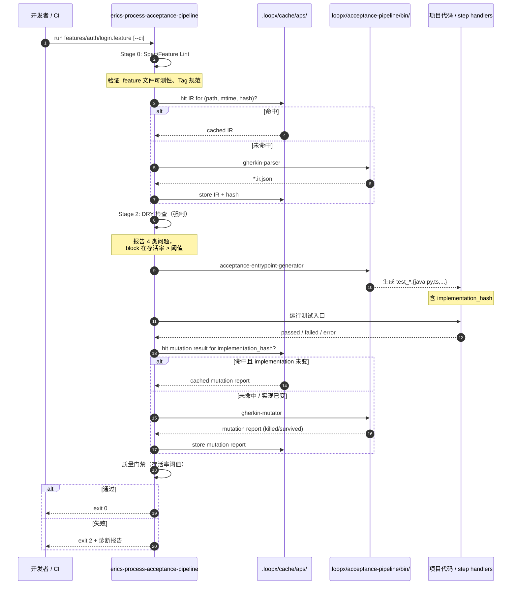

# EricStack + Acceptance Pipeline Specification (APS) 整合方案

> 整合日期：2026-08-16 | 整合目标：P0
> 参考：[unclebob/Acceptance-Pipeline-Specification](https://github.com/unclebob/Acceptance-Pipeline-Specification) + [topdigg/acceptance-pipeline-specification](https://www.topdigg.com/blog/acceptance-pipeline-specification)
> 文档版本：v1.1（基于 v1.0 审计增强）

---

## 一、背景与目标

### 1.1 Uncle Bob 的 Acceptance Pipeline Specification (APS)

APS 是与框架无关的验收测试管道，核心流程：

```
Feature File (.feature)
  → gherkin-parser          → JSON IR
  → gherkin-ir-dry-checker  → duplicate report
  → acceptance-generator    → 生成的测试入口
  → project runner          → 测试结果
  → gherkin-mutator         → 变异测试
```

**Uncle Bob 三件套（与 APS 一同构成完整 TDD 闭环）：**
- **APS**（本方案）— 验收管道，从 spec 到可执行验收测试
- **Transformation Priority Premise (TPP)** — 实现步骤的优先级约束
- **Three Rules of TDD** — 红 / 绿 / 重构的纪律

### 1.2 EricStack 现状

- `erics-ability-bdd` — Gherkin 场景生成能力（已有）
- `erics-process-mutation` — 源码级变异测试（已有）
- 缺少：完整 APS 管道编排 + Gherkin 变异测试 + 测试运行适配层 + 增量缓存层

### 1.3 整合目标

将 APS 的完整管道整合为 EricStack 的内置 discipline，形成从需求到可验证代码的完整 AI-Era TDD 闭环。

**关键价值：**
- 业务方可读的自然语言验收标准
- 与框架解耦（同一套 `.feature` 可驱动 JUnit/Pytest/Jest 等）
- 需求级变异测试（验证"测试是否真正约束了需求"而非仅约束实现）

---

## 二、整合架构

### 2.1 端到端时序图



### 2.2 新增 / 修改的 Skills

| Skill | 类型 | 用途 |
|---|---|---|
| `erics-process-acceptance-pipeline` | process (discipline) | 主管道：协调 APS 全流程（含增量缓存 + 进度反馈） |
| `erics-ability-bdd` (重写) | ability | Gherkin 场景编写 + JSON IR 解析 + DRY 检查 + Spec Lint |
| `erics-ability-test-runner` (新增) | ability | 项目级测试运行器适配器（带 sandboxing） |
| `erics-process-mutation` (已有，对接) | process | 对接 APS gherkin-mutator + 增量策略 |

### 2.3 目录结构

```
.loopx/
├── acceptance-pipeline/                   # APS 工具集
│   ├── bin/
│   │   ├── bb/                            # Babashka 脚本（首选）
│   │   ├── aps-$(uname -s)-$(uname -m)/   # Go 二进制（fallback）
│   │   └── acceptance-entrypoint-generator # 项目自定义
│   ├── features/                          # 用户编写的 .feature 文件
│   │   ├── auth/
│   │   ├── api/
│   │   └── ui/
│   ├── ir/                                # 解析后的 JSON IR
│   │   └── *.ir.json
│   ├── generated/                         # 生成的测试入口代码
│   │   ├── metadata/
│   │   │   └── *.json                     # 含 implementation_hash
│   │   └── test_*.java / test_*.py 等
│   ├── reports/
│   │   ├── dry-check/                     # DRY 检查报告
│   │   ├── run/                           # 运行报告（JUnit XML）
│   │   └── mutation/                      # 变异测试报告
│   └── acceptance.env                     # 项目配置（含 framework, sandbox 策略）
├── cache/
│   └── aps/                               # NEW: 增量缓存层
│       ├── ir/<hash>.json
│       ├── dry/<hash>.json
│       └── mutation/<impl-hash>.json
├── skills/
│   ├── erics-process-acceptance-pipeline/ # 主编排
│   ├── erics-ability-bdd/                 # 扩展为 APS 前半段
│   ├── erics-ability-test-runner/         # 测试运行适配器
│   └── erics-process-mutation/            # 对接 APS mutator
└── wiki/
    └── concepts/
        └── acceptance-pipeline.md
```

---

## 三、Skills 详细设计

### 3.1 `erics-process-acceptance-pipeline` (主编排)

**触发词：** `acceptance pipeline`, `验收管道`, `APS`, `gherkin 流程`, `acceptance test pipeline`, `运行验收测试`

**职责：** 端到端编排 APS 全流程，协调各子工具的执行顺序，管理增量缓存、进度反馈、失败诊断。

#### 3.1.1 工作流（7 阶段，含 Stage 0 与 Stage 6）

```
Stage 0: Spec/Feature Lint (新增)
  校验 .feature 文件可测性、Tag 规范、Background 必填项
  产出: lint report (.loopx/cache/aps/lint/<hash>.json)

Stage 1: 解析 (Parse) — 增量
  if cache hit (path, mtime, content-hash): skip
  else: bb gherkin-parser <feature-file> <output.ir.json>

Stage 2: DRY 检查 (强制，非可选)
  bb gherkin-ir-dry-checker [--include-exact] <ir.json> <report-output>
  检查类别:
    - duplicate-in-scenario        # 场景内完全重复的 step
    - placeholder-variant          # 可参数化的 placeholder 变体
    - near-duplicate               # 近似重复 (相似度 > 0.85)
    - possible-synonym             # 可能同义词
  阻断阈值:
    - duplicate-in-scenario > 0    → block (exit 1)
    - placeholder-variant > 3      → block + 修复建议
    - near-duplicate > 0.85        → warn (exit 0 但生成 TODO)

Stage 3: 生成测试入口 (Generate)
  acceptance-entrypoint-generator <ir.json> <generated-output/>
  生成: 测试框架特定的入口代码 (JUnit5 / Pytest / Behave 等)
  写入: metadata/<feature-name>.json (含 implementation_hash)
  含 step definition 覆盖率报告:
    - IR 中出现的 step 文本 vs 项目中注册的 handler
    - 缺失 handler 的 step 列表 → 测试必失败（fail-fast）

Stage 4: 运行验收测试 (Run)
  if --changed-only: 运行 git diff 影响的 scenario
  else: 运行 generated/ 下全部
  报告: passed / failed / error（区分 handler missing vs assertion failed）
  产物: JUnit XML → .loopx/acceptance-pipeline/reports/run/

Stage 5: 变异测试 (Mutate) — P0 质量门禁
  bb gherkin-mutator [options]
  增量策略:
    - 读取 metadata/<feature>.json 的 implementation_hash
    - if hash unchanged AND cache hit: skip（秒级返回）
    - else: 全量运行，cache 报告
  报告: killed / survived / error 分类

Stage 6: 失败诊断 (新增 — always run on failure)
  自动收集失败用例 + step 文本 + handler 调用栈 + IR 路径
  输出: .loopx/acceptance-pipeline/reports/diagnose/<scenario>.md
```

#### 3.1.2 CLI 接口

```bash
# 基础
/acceptance-pipeline run <feature-glob>            # 运行单个/多个 feature
/acceptance-pipeline check <feature-glob>           # 仅 Stage 0-2（DRY），不生成不运行
/acceptance-pipeline mutate <feature-glob>          # 仅 Stage 5（变异）

# 模式
/acceptance-pipeline run --ci                       # CI 模式：JUnit XML + 严格门禁
/acceptance-pipeline run --dry-run                  # 只打印将要执行的动作，不实际执行
/acceptance-pipeline run --changed-only             # 仅运行 git diff 影响的 scenario
/acceptance-pipeline run --no-cache                 # 强制全量（用于调试缓存问题）
/acceptance-pipeline run --fail-fast                # 首个失败即停

# 输出
/acceptance-pipeline run --verbose                  # 详细日志（每个 step 执行）
/acceptance-pipeline run --quiet                     # 仅输出错误与最终报告
/acceptance-pipeline run --progress=<fmt>           # auto|bar|json|plain

# 调试
/acceptance-pipeline run --explain-failure          # 失败时输出 Stage 6 诊断报告
/acceptance-pipeline run --trace                    # 完整 trace span（OpenTelemetry 格式）

# 报告
/acceptance-pipeline report --summary               # 显示上次运行的汇总
/acceptance-pipeline report --trends                 # 历史存活率趋势
```

#### 3.1.3 退出码约定

| 退出码 | 含义 |
|---|---|
| `0` | 全部通过 |
| `1` | 解析 / 生成 / 运行错误（含 DRY 阻断、handler missing） |
| `2` | 变异测试存活率超过质量门禁 |
| `3` | 用户中断（SIGINT） |
| `4` | 环境错误（BB 缺失、工具版本不匹配） |
| `130` | SIGKILL 强制终止 |

#### 3.1.4 增量缓存策略（核心性能保障）

```
缓存键设计:
  IR 缓存:     hash(absolute_path + mtime + sha256(content))
  DRY 缓存:    hash(IR content)
  变异缓存:    hash(implementation_hash + IR content)
  Lint 缓存:   hash(feature content)

失效策略:
  - 任意相关文件 mtime 变化 → 失效
  - implementation_hash 变化 → 仅失效变异缓存
  - IR 内容变化 → 失效 IR + DRY + 变异（级联）
  - 显式 --no-cache 绕过

TTL: 默认 7 天（防止 stale 缓存），CI 上禁用 TTL
清理: /acceptance-pipeline cache --gc (基于 LRU + TTL)
```

#### 3.1.5 Stage 钩子（Plugin 扩展点）

```yaml
# .loopx/acceptance-pipeline/hooks.yaml
hooks:
  before_parse:        # Stage 1 前
    - "scripts/preprocess-feature.clj"
  after_parse:         # Stage 1 后
    - "scripts/validate-ir.py"
  before_generate:     # Stage 3 前
    - "scripts/check-step-coverage.sh"
  after_run:           # Stage 4 后
    - "scripts/snapshot-db-state.sh"
  before_mutate:       # Stage 5 前
    - "scripts/seed-mutation-fixtures.sh"
  on_failure:          # 任意 stage 失败
    - "scripts/notify-slack.sh"
```

---

### 3.2 `erics-ability-bdd` (重写扩展)

**已有功能（保留）：** Gherkin 场景生成、Given-When-Then 编写规范。

**新增功能（4 项）：**

#### 3.2.1 Spec/Feature Lint

```
校验规则（可执行化）:
  - 每个 feature 至少含 1 个 scenario
  - 每个 scenario 必须含 Background 或显式 no-background
  - Tag 必须在白名单内 (@smoke, @regression, @auth, @api, @ui)
  - step 文本禁止首字母大写后跟动词以外的内容
  - Scenario Outline 必须含 Examples 表
  - 步骤数 ≥ 3 且 ≤ 15（避免过长 scenario）
```

#### 3.2.2 Feature 文件创建辅助

- 根据需求描述生成初始 `.feature` 文件
- 使用 Scenario Outline 进行数据参数化
- 正确的 Tag 组织 (`@auth`, `@smoke`, `@regression`)

#### 3.2.3 JSON IR 解析执行（增量）

```
执行策略:
  if cache hit: skip parsing
  else: 调用 gherkin-parser → JSON IR → cache
  验证 IR 结构正确性（schema 校验）
```

#### 3.2.4 DRY 检查执行 + 修复建议

- 调用 `gherkin-ir-dry-checker`
- 解释报告中的 4 类问题并给出修复建议
- 自动合并明显的 placeholder-variant（需 dry-run 预览 + 用户确认）

#### 3.2.5 Step Definition 覆盖率分析

```
输入: 生成的 IR + 项目 step handlers 注册表
输出: 
  - covered_steps: N (handler 找到)
  - missing_handlers: [step_text, ...]
  - orphan_handlers: [handler, unused_in_ir]
行动:
  missing_handlers > 0 → Stage 3 必失败（fail-fast）
  orphan_handlers → warn（提示可清理）
```

---

### 3.3 `erics-ability-test-runner` (新增)

**触发词：** `test runner`, `run acceptance tests`, `运行验收测试`

**职责：** 抽象层，对接项目实际使用的测试框架，含 **Sandboxing 与 Side Effect 控制**。

#### 3.3.1 Step Handler 核心契约（来自 APS 规范）

```yaml
world_object:
  lifecycle: 每个 scenario execution 获得独立实例
  disposal: scenario 结束后必须 reset（DB rollback / temp cleanup）
  serialization: 必须可序列化（用于 trace/debug）

step_execution:
  inputs:
    - world (mutable per scenario)
    - step_text (matched regex/cucumber-expression)
    - example_values (dict from Examples table)
  outputs:
    - world mutation
    - step result (pass/fail/error)

background_steps:
  prepend: 每个 scenario 开头都执行
  shared_state: 通过 world 而非全局变量传递

placeholder_binding:
  regex_match: 捕获组名 → example key
  cucumber_expression: {string} → example key
  unmatched_placeholder: 测试失败 (fail-fast)

unsupported_step:
  behavior: 测试失败（不静默跳过）
  error_msg: 列出 registered handlers 供参考
```

#### 3.3.2 支持的框架适配器

| 框架 | 适配器输出 | Sandboxing | 说明 |
|---|---|---|---|
| JUnit 5 (Java) | `*Test.java` | @TempDir + extension | 生成标准 JUnit 5 测试入口 |
| Pytest (Python) | `test_*.py` | pytest tmp_path fixture | 生成 pytest 格式入口 |
| Behave (Python BDD) | 直接运行 `.feature` | environment.py hooks | 无需生成，直接用 Behave |
| Go testing | `*_test.go` | t.TempDir() | 生成 Go test 格式入口 |
| Jest (JS/TS) | `*.test.ts` | beforeEach/afterEach | 生成 Jest 格式入口 |
| RSpec (Ruby) | `*_spec.rb` | around hooks | 生成 RSpec 格式入口 |
| **vitest** (NEW) | `*.test.ts` | vi.resetAll | 现代 Vite 生态 |
| **Kotest** (NEW) | `*Test.kt` | autoClose | Kotlin 测试 |

**Sandboxing 默认策略：**
- 每个 scenario 前：清空 DB（transaction rollback）、重置 HTTP mock、清理 tmp 目录
- 每个 scenario 后：验证 world.disposal() 被调用
- Side effect 监控：检测意外的外部副作用（网络写、文件写、邮件发送）→ 警告

#### 3.3.3 Hooks（Before/After Scenario）

```python
# 生成的 Pytest 入口示例
@pytest.fixture(autouse=True)
def scenario_world(scenario):
    world = World()
    yield world
    world.dispose()  # 自动清理

def test_login_success(scenario_world):
    # Before Scenario
    seed_db(scenario_world)
    # Given/When/Then
    scenario_world.given("a registered user")
    scenario_world.when("they login with valid credentials")
    # After Scenario（自动 dispose）
    assert scenario_world.then("they see the dashboard")
```

---

### 3.4 `erics-process-mutation` (已有，对接 APS)

**已有功能：** 变异测试原理、工具选择（mutmut / stryker-js / pitest）、存活率分析。

**新增 APS gherkin-mutator 对接（含增量 + 趋势）：**

```bash
# APS Gherkin 变异测试运行方式（含增量）
bb gherkin-mutator \
  --manifest <ir.json> \
  --runner ./bin/runner-adapter \
  --output build/acceptance-mutation/ \
  --incremental-key <implementation_hash> \
  --cache-dir .loopx/cache/aps/mutation/

# 输出: mutation-report.json
# 格式: { killed: N, survived: M, error: E, survival_rate: X%,
#          by_category: {step_removal: {killed, survived}, ...} }
```

**质量门禁规则（分级，避免一刀切）：**

| 存活率区间 | 处理 | 退出码 |
|---|---|---|
| `< 3%` | 优秀 | 0 |
| `3% – 8%` | warn + 显示历史趋势 | 0 |
| `8% – 15%` | warn + 生成改进 TODO | 0 |
| `> 15%` | block merge | 2 |
| `> 30%` | block merge + alert + 标记为 P1 技术债 | 2 |

**白名单（合理存活）：**
- 测试基础设施代码（如 logging）
- 防御性代码（如 null check for impossible state）
- 显式标注 `@mutation-suppress` 的代码块

**趋势跟踪：**
```bash
/acceptance-pipeline report --trends
# 输出: 存活率历史折线图（ASCII），识别项目从"绿"变"红"的拐点
```

---

## 四、APS 工具集安装方案

### 4.1 安装策略

优先 **Babashka**（Clojure 脚本），无 BB 时用 **Go 二进制** fallback。

**安装脚本：** `.loopx/bin/install-acceptance-pipeline.sh`

```bash
#!/bin/bash
set -euo pipefail

APS_VERSION="${APS_VERSION:-v1.2.0}"  # 锁定版本，避免 spec 演进破坏
APS_DIR="$PWD/.loopx/acceptance-pipeline"
BIN_DIR="$APS_DIR/bin"
CACHE_DIR="$PWD/.loopx/cache/aps"

# 校验版本签名（防止 supply chain 攻击）
verify_checksum() {
  local file=$1 expected=$2
  echo "$expected  $file" | sha256sum -c --quiet
}

# 检测 Babashka
if command -v bb &> /dev/null; then
  echo "Using Babashka"
  mkdir -p "$BIN_DIR/bb"
  curl -fsSL "https://github.com/unclebob/Acceptance-Pipeline-Specification/releases/download/$APS_VERSION/bb.tar.gz" \
    | tar xz -C "$BIN_DIR/bb"
  verify_checksum "$BIN_DIR/bb/gherkin-parser" "$(cat .loopx/aps.checksums | grep gherkin-parser)"
else
  echo "Babashka not found, using Go binaries"
  curl -fsSL "https://github.com/unclebob/Acceptance-Pipeline-Specification/releases/download/$APS_VERSION/aps-$(uname -s)-$(uname -m).tar.gz" \
    -o /tmp/aps.tar.gz
  verify_checksum /tmp/aps.tar.gz "$(cat .loopx/aps.checksums | grep $(uname -s))"
  tar xzf /tmp/aps.tar.gz -C "$BIN_DIR"
fi

mkdir -p "$APS_DIR"/features ir generated reports \
         "$CACHE_DIR"/ir dry mutation lint

# 生成默认配置
[ -f "$APS_DIR/acceptance.env" ] || cat > "$APS_DIR/acceptance.env" <<EOF
FRAMEWORK=pytest
SANDBOX=auto
MUTATION_THRESHOLD_WARN=8
MUTATION_THRESHOLD_BLOCK=15
CACHE_TTL_DAYS=7
PROGRESS=auto
EOF

echo "APS $APS_VERSION installed at $APS_DIR"
```

### 4.2 工具清单

| 工具 | 来源 | 用途 |
|---|---|---|
| `gherkin-parser` | APS repo (pinned) | `.feature` → JSON IR |
| `gherkin-ir-dry-checker` | APS repo (pinned) | JSON IR → DRY 报告 |
| `acceptance-entrypoint-generator` | 项目自定义 | JSON IR → 测试入口代码 |
| `gherkin-mutator` | APS repo (pinned) | JSON IR → 变异测试 |

**版本管理：**
- 所有 APS 工具锁定到 `$APS_VERSION`
- `.loopx/aps.checksums` 记录 SHA256（提交到 git）
- 升级路径：`/acceptance-pipeline upgrade --to v1.3.0`（生成 changelog + 测试）

---

## 五、工作流集成

### 5.1 完整 AI-Era TDD 流程（整合 Uncle Bob 三件套 + 失败反馈闭环）

```
需求输入
    ↓
[1] erics-ability-spec
    模糊需求 → 精确 spec
    ↓
[2] erics-ability-bdd
    spec → Gherkin .feature 文件 (经 Spec Lint)
    ↓
[3] erics-process-acceptance-pipeline  ←──────┐
    ├── Stage 0: Spec Lint                 │ 失败
    ├── Stage 1: gherkin-parser (增量)      │ 反馈
    ├── Stage 2: DRY 检查（强制）           │ 闭环
    ├── Stage 3: 生成测试入口（fail-fast）  │
    ├── Stage 4: 运行验收测试              │
    ├── Stage 5: gherkin-mutator (增量)    │
    └── Stage 6: 失败诊断 ─────────────────┘
    ↓
[4] erics-process-mutation
    源码级变异测试（补充 APS 变异）
    ↓
代码实现
    ↓
[5] erics-process-code-review
    ↓
[6] erics-process-pre-push-checks
```

### 5.2 开发者日常工作流

```bash
# 快速运行单个 feature
/acceptance-pipeline run features/auth/login.feature --explain-failure

# 运行全部 acceptance tests
/acceptance-pipeline run --all

# 只做 Lint + DRY 检查（不生成不运行）
/acceptance-pipeline check features/**/*.feature

# CI 模式：生成报告 + 质量门禁
/acceptance-pipeline run --ci --fail-fast

# 增量模式（PR 优化）
/acceptance-pipeline run --changed-only  # 仅跑 git diff 影响的 scenario

# 调试特定 scenario
/acceptance-pipeline run features/auth/login.feature --scenario "valid login" --verbose

# 性能分析
/acceptance-pipeline run --trace --progress=json  # 输出 OpenTelemetry 格式 trace

# 查看历史趋势
/acceptance-pipeline report --trends
```

### 5.3 CI/CD 集成示例

```yaml
# .github/workflows/acceptance.yml
name: Acceptance Pipeline

on: [push, pull_request]

jobs:
  acceptance:
    runs-on: ubuntu-latest
    steps:
      - uses: actions/checkout@v4
        with:
          fetch-depth: 0  # 需要 git diff 用于 --changed-only

      - name: Install APS
        run: bash .loopx/bin/install-acceptance-pipeline.sh

      - name: Cache APS results
        uses: actions/cache@v4
        with:
          path: .loopx/cache/aps
          key: aps-${{ hashFiles('features/**', 'src/**', 'tests/**') }}
          restore-keys: |
            aps-${{ hashFiles('features/**') }}-
            aps-

      - name: Spec lint + DRY check (fast feedback)
        run: loopx acceptance-pipeline check features/**/*.feature

      - name: Run changed scenarios only
        if: github.event_name == 'pull_request'
        run: |
          loopx acceptance-pipeline run --changed-only --ci --explain-failure

      - name: Run full acceptance suite
        if: github.event_name == 'push'
        run: |
          for f in features/**/*.feature; do
            loopx acceptance-pipeline run --ci "$f"
          done

      - name: Mutation test (nightly only)
        if: github.event_name == 'schedule'
        run: loopx acceptance-pipeline mutate --ci features/**/*.feature

      - name: Upload reports
        if: always()
        uses: actions/upload-artifact@v4
        with:
          name: acceptance-reports
          path: |
            .loopx/acceptance-pipeline/reports/run/*.xml
            .loopx/acceptance-pipeline/reports/mutation/*.json
            .loopx/acceptance-pipeline/reports/diagnose/*.md
          retention-days: 30

      - name: Comment PR with mutation trend
        if: github.event_name == 'pull_request' && always()
        uses: actions/github-script@v7
        with:
          script: |
            const fs = require('fs');
            const report = JSON.parse(fs.readFileSync('.loopx/acceptance-pipeline/reports/mutation/summary.json'));
            await github.rest.issues.createComment({
              owner: context.repo.owner,
              repo: context.repo.repo,
              issue_number: context.issue.number,
              body: `## Acceptance Pipeline\n\n` +
                    `- Survival rate: **${report.survival_rate}%**\n` +
                    `- Killed: ${report.killed} / Survived: ${report.survived}\n` +
                    `- Trend: ${report.trend_arrow}`
            });
```

**重试与退避：**
- 变异测试 → 失败重试 1 次（处理 flaky env）
- 网络型 step handler → 指数退避（3 次）
- 不重试：handler missing、assertion failed

---

## 六、与 EricStack 现有 Skills 的关系

### 6.1 能力矩阵（增强版）

| 能力 | erics-ability-bdd | erics-process-acceptance-pipeline | erics-process-mutation |
|---|---|---|---|
| Gherkin 编写 | ✅ | — | — |
| Spec Lint | ✅ (新增) | Stage 0 | — |
| .feature → JSON IR | ✅ (增量) | Stage 1 | — |
| DRY 检查 | ✅ (强制) | Stage 2 | — |
| Step 覆盖率分析 | ✅ (新增) | Stage 3 | — |
| 端到端管道编排 | — | ✅ | — |
| 测试生成 | — | Stage 3 | — |
| 测试运行（含 sandbox） | — | Stage 4 | — |
| 失败诊断 | — | Stage 6 (新增) | — |
| APS Gherkin 变异测试 | — | Stage 5 (增量) | — |
| 源码变异测试 | — | — | ✅ |
| 存活率门禁 | — | ✅ (分级) | ✅ |
| 趋势跟踪 | — | ✅ (新增) | ✅ |

### 6.2 路由规则更新（erics-loop-router）

```yaml
# 新增路由条目（带优先级 + 冲突解决）
- task: "写 Gherkin 验收测试"
  skill: erics-ability-bdd
  priority: 10

- task: "运行完整验收管道"
  skill: erics-process-acceptance-pipeline
  priority: 20
  conflicts_with: [erics-ability-bdd]  # BDD 只生成，pipeline 才运行

- task: "变异测试验证测试质量"
  skill: erics-process-mutation
  priority: 15

- task: "AI-Era TDD 全流程"
  skill: erics-process-acceptance-pipeline
  priority: 30  # 最高，全流程入口

# 冲突解决：当用户说"运行验收测试"时，优先 pipeline 而非单独的 bdd
```

---

## 七、Wiki 知识页

新建 `.loopx/wiki/concepts/acceptance-pipeline.md`：

```markdown
# Acceptance Pipeline Specification

APS 是 Uncle Bob 提出的与框架无关的验收测试管道。

## 核心工具
- gherkin-parser — .feature → JSON IR
- gherkin-ir-dry-checker — JSON IR → DRY 报告
- acceptance-entrypoint-generator — JSON IR → 测试入口
- gherkin-mutator — 变异测试

## 7 阶段管道（含 EricStack 增强）
1. Spec/Feature Lint
2. 解析（增量）
3. DRY 检查（强制）
4. 生成（含 step 覆盖率 fail-fast）
5. 运行（sandboxed）
6. 变异（增量 + 趋势）
7. 失败诊断

## 与 EricStack 集成
- erics-ability-bdd: Gherkin 编写 + Spec Lint
- erics-process-acceptance-pipeline: 主管道
- erics-process-mutation: 源码变异

## 质量门禁
| 存活率 | 处理 |
|---|---|
| < 3% | 优秀 |
| 3-8% | warn |
| 8-15% | warn + TODO |
| > 15% | block |

## 缓存策略
- IR 缓存: hash(path + mtime + content)
- 变异缓存: hash(implementation_hash + IR)
- 默认 TTL: 7 天
```

---

## 八、实施优先级（调整）

| 优先级 | 阶段 | 内容 | 产出 |
|---|---|---|---|
| **P0** | Phase 1 | APS 工具安装 + Spec Lint + IR 解析（增量） + DRY 强制 | 可运行的 check 流程 |
| **P0** | Phase 2 | `erics-process-acceptance-pipeline` skill（含 7 阶段、增量缓存、失败诊断） | 完整管道 |
| **P0** | Phase 3 | `erics-ability-bdd` 重写（含 Spec Lint、step 覆盖率） | 增强 BDD |
| **P1** | Phase 4 | `erics-ability-test-runner` 适配器（Pytest + JUnit5，含 sandboxing） | 实际运行 |
| **P1** | Phase 5 | 增量变异测试 + 趋势跟踪 + 分级门禁 | 性能 + 质量 |
| **P2** | Phase 6 | Wiki + 路由 + CI 集成 | 文档 + 自动化 |
| **P2** | Phase 7 | Plugin hooks + 适配器扩展（vitest/kotest） | 扩展性 |

**Phase 间依赖：**
- Phase 1 → Phase 2 → Phase 3 可并行
- Phase 4 依赖 Phase 2 完成核心管道
- Phase 5 依赖 Phase 4 有可运行测试
- Phase 6/7 独立

---

## 九、风险与缓解（增强版）

| 风险 | 级别 | 缓解 |
|---|---|---|
| APS 工具依赖 Babashka / Go 环境 | 中 | Docker 一键环境 + 纯脚本 fallback + 启动时检测 |
| 测试入口生成与项目框架不兼容 | 高 | Phase 4 先做 Pytest + JUnit5，提供 `@manual-handler` 兜底 |
| 变异测试运行慢（超时） | 中 | 增量缓存（implementation_hash）+ `--changed-only` + 默认只在 CI/nightly 运行 |
| Gherkin 编写质量差导致生成测试无意义 | 中 | Spec Lint + DRY 强制 + step 覆盖率 fail-fast + wiki 模板 |
| APS 规范更新导致工具不兼容 | 低 | 锁定版本 + 校验和 + 升级前 changelog + 兼容性测试 |
| **新增** Step handler 副作用污染测试间状态 | 高 | Sandboxing（自动 cleanup）+ Side effect 监控 + world.dispose 契约 |
| **新增** 缓存 stale 导致假阳性 | 中 | TTL + mtime 失效 + `--no-cache` 调试模式 |
| **新增** 5% 门禁过严导致存量项目无法 merge | 中 | 分级门禁（8%/15%）+ 白名单机制 + 趋势跟踪 |
| **新增** Flaky test 误判 | 中 | 重试机制（仅网络型）+ flaky 检测 + quarantine 模式 |
| **新增** 生成的测试代码未 review | 中 | Phase 2 集成 code review hook + 强制 lint |

---

## 十、失败诊断指南（运行时，新章节）

### 10.1 Stage 失败分类与修复

| Stage | 失败类型 | 修复建议 |
|---|---|---|
| 0 Spec Lint | `missing-tag` | 添加 Tag (`@smoke`/`@regression` 等) |
| 0 Spec Lint | `no-background` | 添加 Background 段或显式 `no-background` |
| 0 Spec Lint | `scenario-too-long` | 拆分为多个 scenario 或提取 helper step |
| 1 Parse | `syntax-error` | 修正 Gherkin 语法（G/W/T 大小写、缩进） |
| 1 Parse | `unmatched-placeholder` | 检查 Examples 表与 step 中的 `{var}` |
| 2 DRY | `duplicate-in-scenario` | 合并相同 step 或提取到 Background |
| 2 DRY | `placeholder-variant > 3` | 用 Scenario Outline 参数化 |
| 2 DRY | `near-duplicate > 0.85` | 人工判断是否合并（不强制） |
| 3 Generate | `step-coverage-missing` | 实现缺失的 step handler（列出文件名+行号） |
| 3 Generate | `framework-mismatch` | 检查 `acceptance.env` 的 FRAMEWORK 配置 |
| 4 Run | `handler-missing` | 同 Stage 3（运行时发现） |
| 4 Run | `assertion-failed` | 检查 expected vs actual，参考 diagnose 报告 |
| 4 Run | `world-dispose-failed` | step handler 漏 cleanup（lint 警告） |
| 4 Run | `side-effect-detected` | 检查 handler 是否越权写外部资源 |
| 5 Mutate | `survived > threshold` | 加强对应 step 的断言（白名单豁免） |
| 5 Mutate | `timeout` | 增加 `--timeout` 或拆分 feature 文件 |

### 10.2 诊断报告格式

```yaml
# .loopx/acceptance-pipeline/reports/diagnose/<scenario>.md
scenario: features/auth/login.feature:42 "valid login"
stage: 4 (Run)
status: FAILED
duration: 1.2s

failure:
  step: "Then they see the dashboard"
  error: AssertionError: expected 'login' page, got 'dashboard'
  world_state:
    current_user: { id: 1, role: 'admin' }
    last_navigation: '/login'
  
suggestions:
  - 1. 检查 When step "they login with valid credentials" 是否成功跳转
  - 2. 检查 world.user 是否在 Then 步骤前已设置 role
  - 3. 参考: src/auth/step_handlers.py:78 的类似 scenario

similar_passing: 
  - "admin login bypass" (features/auth/admin.feature:15)
  
trace_span: otel://aps/run/<uuid>
```

### 10.3 常见修复模式

```
1. Handler missing → 自动 suggest: 在 src/<framework>/step_handlers/ 添加对应函数
2. Flaky test → quarantine: 添加 @quarantine tag，自动重试 3 次后跳过
3. Slow test → 性能瓶颈分析: --trace 输出各 step 耗时排序
4. Mutation survived → 强化断言: 工具建议添加 "And response time < 500ms"
```

---

## 十一、可观察性与调试（新增章节）

### 11.1 输出等级

```
--quiet    : 仅错误 + 最终汇总
--normal   : 默认，进度条 + 摘要 (默认)
--verbose  : 每个 step 执行 + IR diff + cache hit/miss
--trace    : OpenTelemetry span + handler call stack
```

### 11.2 Trace 格式（OpenTelemetry 兼容）

```
span: aps.stage.parse
  duration: 120ms
  cache: hit|miss
  input: features/auth/login.feature
  output: .loopx/acceptance-pipeline/ir/login.ir.json

span: aps.stage.dry_check
  duration: 45ms
  cache: miss
  findings: { duplicate: 0, variant: 2, near_dup: 1, synonym: 0 }

span: aps.stage.generate
  duration: 230ms
  framework: pytest
  coverage: { covered: 8, missing: 0, orphan: 1 }

span: aps.stage.run
  duration: 1200ms
  results: { passed: 5, failed: 1, error: 0 }
  failed_step: "Then they see the dashboard"

span: aps.stage.mutate
  duration: 45000ms
  cache: hit|miss
  by_category: { step_removal: { killed: 12, survived: 1 } }
```

### 11.3 性能分析

```bash
/acceptance-pipeline run --profile
# 输出:
# Stage 0 (Lint):     50ms   0.1%
# Stage 1 (Parse):   120ms   0.3% [cache miss]
# Stage 2 (DRY):      45ms   0.1%
# Stage 3 (Generate): 230ms   0.6%
# Stage 4 (Run):     1200ms   2.7%
# Stage 5 (Mutate): 45000ms  96.3% [cache miss]  ← 优化重点
# Total:           46645ms
```

**性能优化建议：**
- Stage 5 占比 > 50% → 启用增量缓存或减少变异算子
- Stage 4 > 10s → 检查 step handler 中的同步阻塞
- Stage 1 cache miss > 80% → 检查 mtime 时钟漂移

---

## 十二、扩展机制（Plugin，新增章节）

### 12.1 新增框架适配器

```
步骤:
  1. 创建 skills/erics-ability-test-runner/adapters/<framework>.md
  2. 定义模板: 生成器模板 + sandbox 策略 + hook 契约
  3. 注册到 acceptance.env: FRAMEWORK=<framework>
  4. 验证: /acceptance-pipeline run --dry-run
```

### 12.2 自定义变异算子

```yaml
# .loopx/acceptance-pipeline/mutation-overrides.yaml
operators:
  - name: custom-step-removal
    applies_to: ["*Handler"]
    transform: "delete the step's body but keep signature"
    skip_when: "@mutation-suppress"
```

### 12.3 自定义 Stage

```yaml
# .loopx/acceptance-pipeline/custom-stages.yaml
stages:
  - name: snapshot-db
    position: before_mutate
    command: scripts/snapshot-db.sh
    timeout: 60s
    on_failure: block
```

---

## 十三、与 EricStack 现有流程的对比（增强）

| 维度 | EricStack (现状) | + APS 整合后 |
|---|---|---|
| 需求到测试 | `erics-ability-spec` → 手工写测试 | `erics-ability-spec` → `erics-ability-bdd` 生成 `.feature` |
| 测试可读性 | 代码测试，非技术 stakeholder 难读 | Gherkin 自然语言，业务方可直接评审 |
| 测试有效性验证 | `erics-process-mutation`（源码级） | 额外 APS 变异测试（需求级）+ 分级门禁 |
| 端到端管道 | 手工切换多个 skill | `erics-process-acceptance-pipeline` 一键 7 阶段 |
| CI/CD 集成 | 通用测试运行 | 结构化 acceptance 报告 + 质量门禁 + PR 注释 |
| **新增** 测试隔离 | 无显式隔离 | Sandboxing + world.dispose 契约 |
| **新增** 失败诊断 | 原始 stack trace | Stage 6 自动诊断 + 修复建议 |
| **新增** 增量缓存 | 无 | IR + DRY + 变异三级缓存 |
| **新增** 性能反馈 | 无 | --trace + --profile + 趋势跟踪 |
| **新增** 扩展机制 | 无 | Plugin hooks + 自定义 stage + 适配器模板 |

---

## 附录 A：版本演进记录

| 版本 | 日期 | 变更 |
|---|---|---|
| v1.0 | 2026-08-16 | 初版：5 阶段管道 + 基础 Skill 设计 |
| v1.1 | 2026-08-16 | 审计增强：新增 Stage 0/6、增量缓存、失败诊断、可观察性、扩展机制、Sandboxing、分级门禁 |

## 附录 B：参考与延伸阅读

- [Uncle Bob APS Repo](https://github.com/unclebob/Acceptance-Pipeline-Specification)
- [Gherkin Reference](https://cucumber.io/docs/gherkin/)
- [EricStack Process Mutation Skill](../.loopx/skills/erics-process/erics-process-mutation/SKILL.md)
- [EricStack BDD Skill](../.loopx/skills/erics-ability/erics-ability-bdd/SKILL.md)
- 相关 ADR：`docs/adr/0007-acceptance-pipeline.md`（待补）
